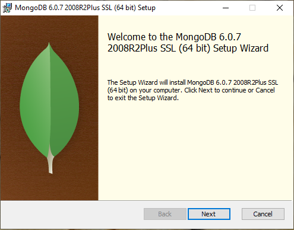
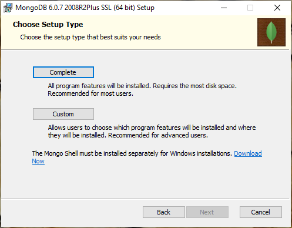
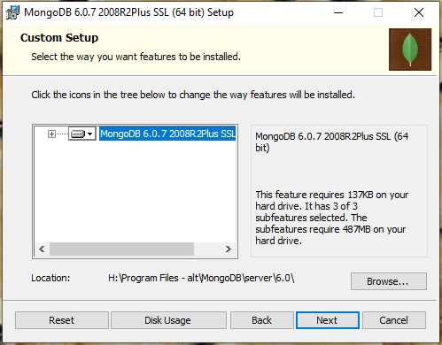
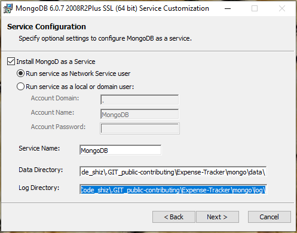
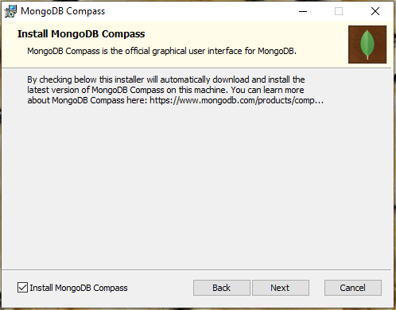
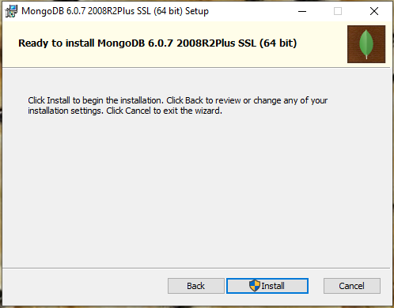

# MongoDB
This expense tracker will utilize mongoDB, a non-SQL database.

## Directory Contents
- `./.installation` - Contains script that tests installation (*possibly installation scripts in the future*), and helper images for this `README`
- `./data` - Target of mongodb for purposes of sharing data and maintaining mongo usage through this repo while local (non-deployed)
- `README.md` - Usage and installation instructions (you're reading this... >_>')

___

### Installation
- Navigate to http://mongodb.com, look for "Products" > "Community Server" > download the appropriate distribution for your environment
  - For Windows: https://fastdl.mongodb.org/windows/mongodb-windows-x86_64-6.0.8-signed.msi
  - For MAC: https://fastdl.mongodb.org/osx/mongodb-macos-x86_64-6.0.8.tgz
- Start the installation wizard
- 
- Accept the terms & conditions
- Choose `Complete` from the "setup type" selections if you are fine with installing everything on your `C:\ `
  - *if your git repo is on your `C:\ `, you're probably fine*...otherwise skip the next bullet
- 
- For non-`C:\ ` installations choose `Custom`
- 
  - In "Custom Setup" look for "Location: "
    - Change this to an appropriate drive location to install the Mongo binaries, **CHANGE NOTHING ELSE**...click "Next"
- In "Service Configuration" leave everything set as default except "Data Directory" & "Log Directory"
- 
  - Set "Data Directory" to `..\Expense-Tracker\mongo\data` *(where **".\Expense-Tracker\"** is the root of the git repo)*
  - Set "Log Directory" to `..\Expense-Tracker\mongo\log` *(where **".\Expense-Tracker\"** is the root of the git repo)*
- Leave "Install MongoDB Compass" checked, click "Next"
- 
- Begin installation, this will take a few minutes
- 

#### Testing the Mongo installation
- Open a terminal or command prompt
- `cd` to the git repo/mongo/.installation
- Run the following command `py test_mongo.py`, it will check connection to mongo and perform CRUD operations
- Follow the prompts from the script, it will tell you if you are set up correctly.